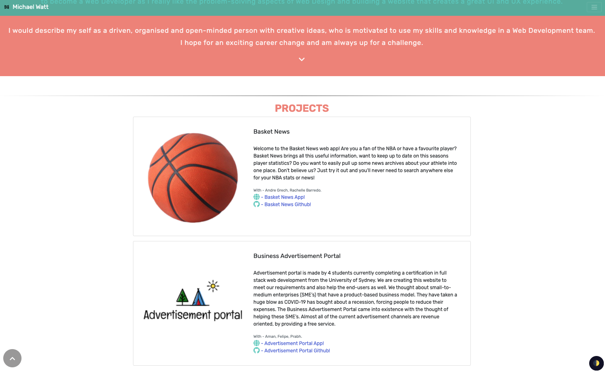
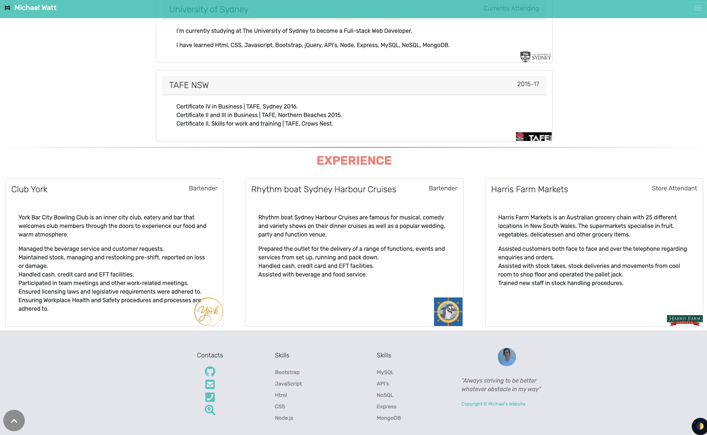
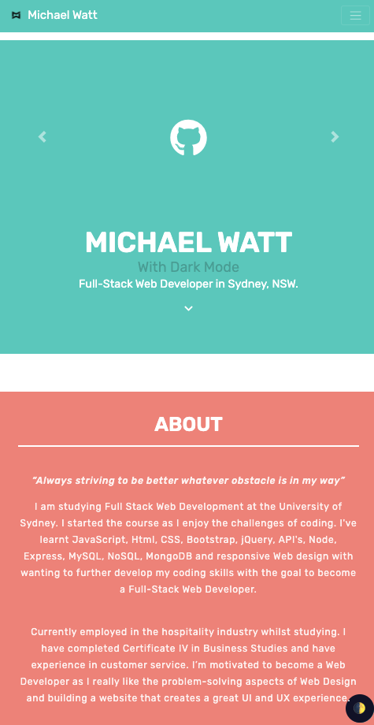

## Portfolio Update

As a type of user, I want to perform Dark-mode Portfolio Update task so that I can achieve some goals and a career change.

### Contents

- index.html
- script.js
- style.css
- img folder, screenshots folder with assets

### User Story

I am Michael Watt, I am studying Full Stack Web Development at the University of Sydney, with skills in Javascript,  Html, CSS, Bootstrap, jQuery, API's, Node, Express, MySQL, NoSQL, MongoDB  and responsive web design.

I have completed Certificate 4 in Business Studies and have experience in customer service and business. I’m motivated to become a web developer as I really like the problem solving aspects of web design and building a website that creates a great UI and UX experience.

I love to learn and enjoy the team work component of web design. I understand how important it is to communicate with the team, to encourage everyone to brainstorm ideas and work through the best design approach.

In summary I would describe myself as:

An organised and open minded person with creative ideas, who is motivated to use my skills and knowledge in a web development team. I am able to work independently as well as in a team to deliver on common goals.

### Final Interface

### Demonstration

Deployed on Github pages: https://github.com/Michaelmw17/MIchaelmw17.github.io/

#### Tools

- [VScode](https://code.visualstudio.com/) - The editor of choice.
- [Javascript](https://developer.mozilla.org/en-US/docs/Web/JavaScript)
- [HTML](https://developer.mozilla.org/en-US/docs/Web/HTML)
- [CSS](https://developer.mozilla.org/en-US/docs/Web/CSS)
- [Bootstrap](https://getbootstrap.com/)

##### Authors

_Michael Watt_

- [Github!](https://github.com/Michaelmw17)
- [LinkedIn!](https://www.linkedin.com/in/michael-watt-6a76961b3/)
- [Portfolio!](http://michaelmw17.github.io/)
- Email:(michaelmw17@outlook.com)

##### License 

- [License](https://github.com/Michaelmw17/MIchaelmw17.github.io/blob/master/LICENSE)
